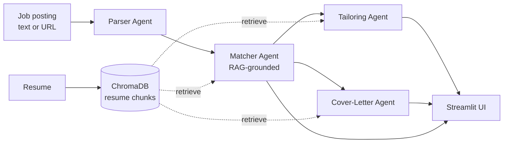
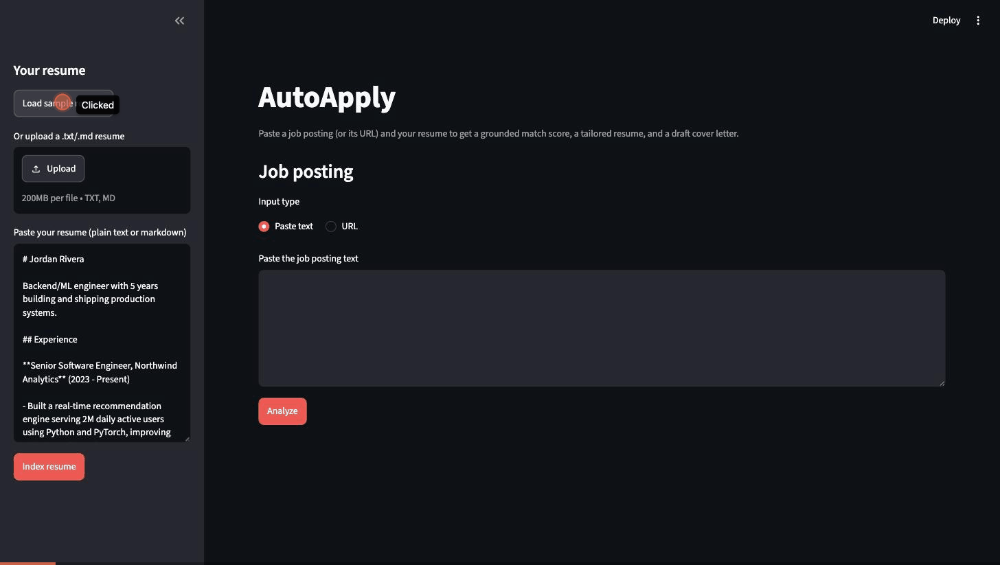

# AutoApply


## The problem

Tailoring a resume + cover letter for every single job posting is exhausting, so most people
either send the same generic resume everywhere (bad match rate) or skip applying to roles that
actually look like a genuinely tight fit but require an hour of resume-shuffling first. And when
people *do* try to "optimize" their resume for a posting, it's really easy to overreach and claim
skills they don't actually have.

AutoApply takes a posting + your real resume and gives you three things in under a minute:

1. A **match score** (0-100) with a per-requirement breakdown, grounded in your actual resume —
   it cites exactly which resume bullet backs up each "covered" verdict.
2. A **tailored resume** for that posting — bullets reworded/reprioritized to speak the posting's
   language, with a hard rule (enforced by prompt *and* a deterministic post-hoc check) that it
   can never claim a skill that isn't actually in your resume.
3. A **draft cover letter** built from your strongest matched experience, not generic filler.

## Architecture



The orchestrator is a [LangGraph](https://github.com/langchain-ai/langgraph) `StateGraph`:
`Parser → Matcher → (Tailoring ‖ Cover-Letter)`. Tailoring and Cover-Letter only depend on the
Matcher's output, not on each other, so they're two edges out of `matcher` — LangGraph runs them
concurrently instead of one after the other (verified this actually happens, not just assumed —
see Design notes below).

| Agent | Input | Output | Grounding |
|---|---|---|---|
| **Parser** | raw posting text or URL | title, company, seniority, required/preferred skills, responsibilities, keywords | — |
| **Matcher** | parsed posting + resume chunks (RAG) | 0-100 score, per-requirement covered/partial/missing breakdown, top gaps | cites resume chunk IDs for every judgment |
| **Tailoring** | parsed posting + resume chunks (RAG) | rewritten/reprioritized bullets | can only rephrase real resume facts, checked post-hoc |
| **Cover-Letter** | parsed posting + match result + resume chunks | greeting, body paragraphs, closing | grounded in the strongest matched chunks |

## What this demonstrates (skills → code)

| Skill | Where |
|---|---|
| LLM APIs (OpenAI + Anthropic + Gemini), provider-agnostic | [`autoapply/llm/provider.py`](autoapply/llm/provider.py) — one client, no provider branching in agent code, swap via `PROVIDER` env var |
| Multi-agent orchestration | [`autoapply/graph/orchestrator.py`](autoapply/graph/orchestrator.py) — LangGraph `StateGraph`, 4 agents, concurrent branch |
| RAG | [`autoapply/rag/`](autoapply/rag) — bullet-level chunking + retrieval grounds the Matcher/Tailoring/Cover-Letter agents |
| Vector DB | [`autoapply/rag/store.py`](autoapply/rag/store.py) — persistent ChromaDB, `add_resume()` / `semantic_search()` |
| Semantic search | `VectorStore.search_postings()` — semantic search over a corpus of past postings, not just the resume |
| Async | [`autoapply/batch.py`](autoapply/batch.py) — `asyncio.gather` + semaphore cap, scores N postings concurrently |
| Prompt engineering | [`autoapply/prompts/`](autoapply/prompts) — versioned templates, Pydantic-validated structured output, no inline prompt strings |

## Reliability

- **Provider-agnostic**: one `LLMClient` with `complete()` / `acomplete()` / `embed()`. Agents
  never touch the OpenAI/Anthropic/Gemini SDKs directly and never branch on which one is active.
- **Retry + timeout + fallback**: exponential backoff via [tenacity](https://github.com/jd/tenacity),
  a request timeout, and automatic fallback to the secondary provider if the primary's exhausted.
- **Structured output**: every agent returns a Pydantic model. The schema goes into the prompt,
  the response gets validated, and a malformed response retries before falling back.
- **Caching**: every LLM call is cached on disk (hash of provider + prompts + temp + schema), so
  re-running the same posting while poking at the UI doesn't cost anything twice.
- **No-fabrication validation**: the Tailoring Agent's prompt says "don't invent experience," but
  prompts aren't trusted on their own — `validate_no_fabrication()` in
  [`agents/tailoring.py`](autoapply/agents/tailoring.py) is a deterministic pass that (1) rejects
  bullets citing a chunk ID that was never actually retrieved and (2) flags claim-y tokens
  (numbers, %, tech-looking words) in the tailored text that don't show up anywhere in the real
  resume.
- **Async batch scoring**: many postings scored concurrently, capped by `BATCH_CONCURRENCY` so it
  doesn't blow through rate limits. One posting failing doesn't take down the batch.
- **Latency logging**: every LLM call logs agent/provider/latency/cache-hit; batch scoring logs
  per-posting latency too.

## Project layout

```
autoapply/
  app.py                  # streamlit entry point
  autoapply/
    config.py             # env vars, model names, concurrency cap
    llm/
      provider.py          # provider-agnostic client
      cache.py             # disk cache, hash-keyed
    rag/
      store.py             # chroma store, add_resume(), semantic_search()
      embeddings.py        # chroma <-> LLMClient.embed() bridge
      chunking.py          # bullet-level + sliding-window chunkers
    agents/
      parser.py  matcher.py  tailoring.py  cover_letter.py
      schemas.py            # pydantic models for agent outputs
    graph/
      orchestrator.py       # langgraph wiring
    prompts/
      parser.py  matcher.py  tailoring.py  cover_letter.py
    batch.py                # async batch scorer + CLI demo
  tests/
    test_provider.py  test_matcher.py  test_no_fabrication.py
  data/
    sample_resume.md  sample_postings/
  requirements.txt
  .env.example
```

## Setup

Needs **Python 3.11+**.

```bash
python3.11 -m venv .venv
source .venv/bin/activate
pip install -r requirements.txt

cp .env.example .env
# fill in a key for whichever provider(s) you want, set PROVIDER=openai / anthropic / gemini
```

`EMBEDDING_PROVIDER` can be `openai` (needs a key) or `local` (sentence-transformers, runs on
your machine, no key needed — good for trying it out without spending anything on embeddings).

## Running it

```bash
streamlit run app.py
```

1. Paste/upload/load-sample your resume in the sidebar, hit **Index resume**.
2. Paste a posting (or its URL), hit **Analyze**.
3. Get the score + breakdown, a tailored resume (word-level diff per bullet, plus any
   fabrication warnings), and a cover letter — all downloadable.

## Batch mode

```bash
python -m autoapply.batch
```

Scores everything in `data/sample_postings/` against `data/sample_resume.md` concurrently and
prints score + latency per posting. Or from your own code:

```python
import asyncio
from autoapply.batch import score_postings

results = asyncio.run(score_postings(
    posting_inputs=["<posting text or URL>", "..."],
    resume_text=open("my_resume.md").read(),
    concurrency=5,
))
for r in results:
    print(r.posting_input[:40], r.state["match_result"].score if r.state else r.error, f"{r.latency_seconds:.2f}s")
```

## Tests

```bash
pytest
```

22 tests, all passing: provider layer (retry/fallback/structured-output/caching, sync+async, all
mocked at the SDK boundary — no real network calls), matcher retrieval/grounding, and the
no-fabrication guarantee (feed a resume missing a skill, have a fake model claim it anyway, assert
the validation pass catches it every time).

## Deploy

No server-side state besides the local Chroma store + disk cache, so it deploys straight to:

- **[Streamlit Community Cloud](https://streamlit.io/cloud)** — connect the repo, `app.py` as
  entry point, add your API key(s) as secrets.
- **[Hugging Face Spaces](https://huggingface.co/spaces)** (Streamlit SDK) — push the repo, add
  the same keys as Space secrets.

**Live demo:** _(link goes here once deployed)_

**Demo GIF:**



(sample resume + a senior ML posting, real Gemini calls — 95/100 match, and the fabrication
check actually caught a word the model swapped in that wasn't in the source resume)

## What I'd build next

- Real resume upload for PDF/DOCX, not just paste/txt/md.
- Let the Matcher weight required vs. preferred skills instead of treating them the same.
- A "history" view backed by `search_postings()` — see all past postings you matched against and
  re-open any of them.
- Swap the word-diff for something closer to a real resume renderer (actual PDF output, not a
  markdown-ish `.txt`).
- Cache invalidation UI — right now the only way to bust the cache is to delete `cache_store/`.
- A small eval set (a few postings + expected coverage) to catch prompt regressions instead of
  eyeballing it.

## Design notes

- **Why chunk resumes by bullet, not fixed window** ([`rag/chunking.py`](autoapply/rag/chunking.py)):
  each chunk = one citable claim. A fixed window would straddle two unrelated bullets and break
  the "cite the exact chunk" thing the Matcher does.
- **Why the fabrication check is deterministic, not another LLM call**
  ([`agents/tailoring.py`](autoapply/agents/tailoring.py)): needs to be testable
  (`tests/test_no_fabrication.py`) and needs to run on every call without extra latency/cost — a
  second model call would be slower and could itself miss the fabrication.
- **Why Tailoring and Cover-Letter share retrieval** ([`agents/matcher.py`](autoapply/agents/matcher.py)):
  `gather_grounding_chunks()` / `format_chunks()` are reused by all three post-Parser agents, one
  place decides how a posting's requirements map to retrieval queries.
- **Confirmed the concurrent branch is actually concurrent**: ran the orchestrator with a fake
  client that sleeps 0.4s in both the tailoring and cover-letter calls — total pipeline time came
  out to ~0.41s, not ~0.8s, so LangGraph really is running them in parallel and not just looking
  like it on paper.
