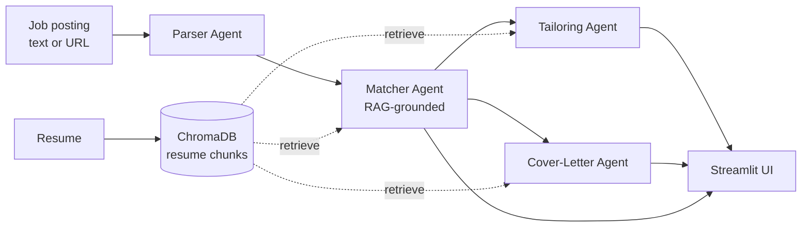

# AutoApply

A multi-agent AI system that takes a job posting (URL or pasted text) and your resume, and
produces:

1. A **match score** (0-100) with a per-requirement breakdown, grounded in your actual resume
   and citing exactly which resume chunks support each judgment.
2. A **tailored version of your resume** for that posting — rephrased and reprioritized, never
   fabricated, with a deterministic validation pass that flags any claim it can't trace back to
   your real resume.
3. A **draft cover letter** built from the strongest matched experience.

Built to demonstrate modern LLM engineering end to end: a provider-agnostic LLM layer, RAG over
a real vector database, LangGraph multi-agent orchestration with concurrent branches, structured
(Pydantic-validated) outputs, async batch scoring, and retry/timeout/fallback/caching reliability.

## Architecture



The **Orchestrator** is a [LangGraph](https://github.com/langchain-ai/langgraph) `StateGraph`:
`Parser → Matcher → (Tailoring ‖ Cover-Letter)`. Tailoring and Cover-Letter both depend only on
the Matcher's output, not on each other, so they're wired as two edges out of `matcher` — LangGraph
schedules and awaits them concurrently rather than running them one after another.

| Agent | Input | Output | Grounding |
|---|---|---|---|
| **Parser** | raw posting text or URL | title, company, seniority, required/preferred skills, responsibilities, keywords | — |
| **Matcher** | parsed posting + resume chunks (RAG) | 0-100 score, per-requirement covered/partial/missing breakdown, top gaps | cites resume chunk IDs for every judgment |
| **Tailoring** | parsed posting + resume chunks (RAG) | rewritten/reprioritized bullets | may only rephrase real resume facts; validated post-hoc |
| **Cover-Letter** | parsed posting + match result + resume chunks | greeting, body paragraphs, closing | grounded in the strongest matched chunks |

## Reliability

- **Provider-agnostic**: [`autoapply/llm/provider.py`](autoapply/llm/provider.py) exposes one
  `LLMClient` with `complete()` / `acomplete()` / `embed()`. Agents never import the OpenAI or
  Anthropic SDKs directly, and never branch on which provider is active — that's chosen once via
  the `PROVIDER` env var.
- **Retry + timeout + fallback**: every call is retried with exponential backoff (via
  [tenacity](https://github.com/jd/tenacity)) and has a request timeout; if the primary provider
  is exhausted, the client automatically falls back to `FALLBACK_PROVIDER`.
- **Structured output**: every agent returns a Pydantic model, not a hopefully-JSON-shaped
  string. The schema is injected into the prompt, and the response is validated — a malformed
  response triggers a retry before falling back to the secondary provider.
- **Caching**: every LLM call is cached on disk, keyed by a hash of
  `(provider, system prompt, user prompt, temperature, schema)`. Re-running the same posting
  twice while iterating in the UI costs nothing.
- **No-fabrication validation**: the Tailoring Agent's system prompt forbids inventing
  experience, but the prompt alone isn't trusted — [`validate_no_fabrication()`](autoapply/agents/tailoring.py)
  is a deterministic, LLM-independent pass that (1) rejects bullets citing a resume chunk ID that
  was never actually retrieved, and (2) flags claim-bearing tokens (numbers, percentages,
  technology/proper-noun-like words) in the tailored text that don't appear anywhere in the
  source resume.
- **Async batch scoring**: [`autoapply/batch.py`](autoapply/batch.py) scores many postings
  concurrently via `asyncio`, capped by `BATCH_CONCURRENCY` so a large batch doesn't blow past
  provider rate limits. One posting failing doesn't abort the rest.
- **Latency logging**: every LLM call logs `agent`, `provider`, `latency`, and cache hit/miss;
  the batch scorer logs per-posting latency.

## Project structure

```
autoapply/
  app.py                  # Streamlit entry point
  autoapply/
    config.py             # env vars, model names, concurrency cap - single source of settings
    llm/
      provider.py          # provider-agnostic client: complete()/acomplete()/embed()
      cache.py             # hash-keyed disk response cache
    rag/
      store.py             # ChromaDB init, add_resume(), semantic_search(), postings corpus
      embeddings.py        # bridges LLMClient.embed() to Chroma's EmbeddingFunction interface
      chunking.py           # bullet-level resume chunking, sliding-window text chunking
    agents/
      parser.py  matcher.py  tailoring.py  cover_letter.py
      schemas.py            # Pydantic models for every agent's structured output
    graph/
      orchestrator.py       # LangGraph graph + state
    prompts/
      parser.py  matcher.py  tailoring.py  cover_letter.py   # versioned prompt templates
    batch.py                # async multi-posting scorer (+ CLI demo)
  tests/
    test_provider.py  test_matcher.py  test_no_fabrication.py
  data/
    sample_resume.md  sample_postings/
  requirements.txt
  .env.example
```

## Setup

Requires **Python 3.11+**.

```bash
python3.11 -m venv .venv
source .venv/bin/activate
pip install -r requirements.txt

cp .env.example .env
# edit .env: set OPENAI_API_KEY and/or ANTHROPIC_API_KEY, and PROVIDER=openai|anthropic
```

`EMBEDDING_PROVIDER` can be `openai` (uses `text-embedding-3-small`, needs `OPENAI_API_KEY`) or
`local` (uses a local `sentence-transformers` model — no API key needed, good for
trying the app without spending on embeddings).

## Running the app

```bash
streamlit run app.py
```

1. Paste (or upload, or load the bundled sample) your resume in the sidebar and click
   **Index resume**.
2. Paste a job posting or its URL, click **Analyze**.
3. View the match score + requirement breakdown, the tailored resume (with an inline
   word-level diff per bullet and any fabrication-validation warnings), and the draft cover
   letter — each downloadable as `.txt`.

## Batch scoring

Score every posting in `data/sample_postings/` against `data/sample_resume.md`, concurrently:

```bash
python -m autoapply.batch
```

Or from your own code:

```python
import asyncio
from autoapply.batch import score_postings

results = asyncio.run(score_postings(
    posting_inputs=["<posting text or URL>", "..."],
    resume_text=open("my_resume.md").read(),
    concurrency=5,
))
for r in results:
    print(r.posting_input[:40], r.state["match_result"].score if r.state else r.error, f"{r.latency_seconds:.2f}s")
```

## Tests

```bash
pytest
```

22 tests covering: the provider layer (retry, fallback, structured-output validation, caching,
sync + async — all mocked at the SDK boundary, no real network calls), the matcher's retrieval
and grounding, and the no-fabrication guarantee (a resume missing a skill, a model that claims it
anyway, and an assertion that the validation pass always catches it).

## Deployment

The app has no server-side state beyond the local Chroma store and disk cache, so it deploys
directly to either:

- **[Streamlit Community Cloud](https://streamlit.io/cloud)**: connect this repo, set `app.py`
  as the entry point, and add `OPENAI_API_KEY`/`ANTHROPIC_API_KEY` as secrets.
- **[Hugging Face Spaces](https://huggingface.co/spaces)** (Streamlit SDK): push this repo to a
  Space and add the same keys as Space secrets.

*(Live demo link: add here once deployed.)*

## Design notes

- **Why chunk resumes by bullet, not fixed-size window** ([`rag/chunking.py`](autoapply/rag/chunking.py)):
  each chunk is a single citable claim. A fixed-size window would often straddle two unrelated
  bullets, which breaks the Matcher's ability to cite one specific chunk per judgment.
- **Why the no-fabrication check is deterministic, not another LLM call**
  ([`agents/tailoring.py`](autoapply/agents/tailoring.py)): it needs to be reliably testable (see
  `tests/test_no_fabrication.py`) and needs to run on every single tailoring call without adding
  latency/cost — a second model call would be slower, non-deterministic, and itself capable of
  missing a fabrication.
- **Why Tailoring and Cover-Letter share retrieval logic** ([`agents/matcher.py`](autoapply/agents/matcher.py)):
  `gather_grounding_chunks()`/`format_chunks()` are used by all three post-Parser agents so
  there's exactly one place that decides how a posting's requirements map to retrieval queries.
